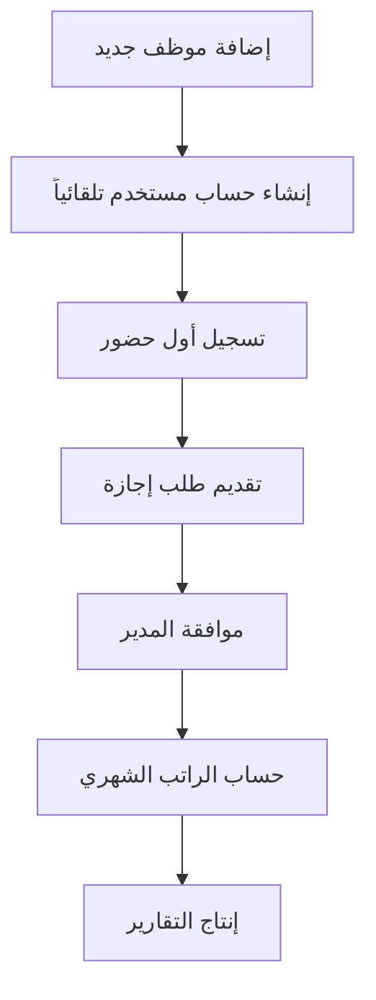

# 📖 دليل قراءة وفهم المشروع

**تاريخ الإنشاء**: 3 أغسطس 2025  
**آخر تحديث**: 3 أغسطس 2025  
**الإصدار**: 1.0.0

---

## 🎯 كيفية قراءة وفهم هذا المشروع

### للمطورين الجدد: ابدأ هنا! 👋

إذا كنت مطوراً جديداً أو تريد فهم هذا المشروع، فهذا الدليل سيرشدك خطوة بخطوة لفهم كامل لآلية عمل نظام HR Smart Core.

---

## 📚 التسلسل الصحيح لقراءة الوثائق

### المرحلة 1: الفهم العام (30 دقيقة)
1. **اقرأ أولاً**: `README.md` - للحصول على نظرة عامة سريعة
2. **ثم اقرأ**: `01_project_overview.md` - لفهم رؤية وأهداف المشروع
3. **بعدها**: `02_requirements_analysis.md` - لفهم ما يفترض أن يفعله النظام

### المرحلة 2: الفهم التقني (45 دقيقة)
4. **اقرأ**: `03_system_architecture.md` - لفهم كيفية بناء النظام
5. **ثم**: `04_installation_guide.md` - لتثبيت النظام وتشغيله
6. **بعدها**: `05_development_guide.md` - لفهم طريقة التطوير

### المرحلة 3: التطبيق العملي (60 دقيقة)
7. **جرب**: تثبيت النظام بنفسك واتبع خطوات التثبيت
8. **اختبر**: تشغيل النظام والدخول إلى لوحة الإدارة
9. **تصفح**: الكود المصدري وفهم الهيكل

---

## 🧩 فهم هيكل المشروع

### 📁 المجلدات الرئيسية وما تحتويه:

```
hr_smart_core/
├── 📁 hr_system/              # إعدادات Django الرئيسية
│   ├── settings.py            # ⚙️ إعدادات النظام (قواعد البيانات، الأمان، إلخ)
│   ├── urls.py                # 🔗 الروابط الرئيسية للنظام
│   └── wsgi.py                # 🚀 ملف تشغيل النظام
│
├── 📁 apps/                   # التطبيقات (الوحدات الوظيفية)
│   ├── 📁 authentication/     # 🔐 تسجيل الدخول والصلاحيات
│   ├── 📁 companies/          # 🏢 إدارة الشركات والفروع
│   ├── 📁 employees/          # 👥 إدارة بيانات الموظفين
│   ├── 📁 attendance/         # ⏰ الحضور والانصراف
│   ├── 📁 leaves/             # 🏖 إدارة الإجازات
│   ├── 📁 payroll/            # 💰 حساب الرواتب
│   └── 📁 reports/            # 📊 التقارير والإحصائيات
│
├── 📁 static/                 # الملفات الثابتة (CSS, JS, صور)
├── 📁 media/                  # ملفات المستخدمين (صور، مستندات)
├── 📁 templates/              # قوالب HTML
├── 📁 utils/                  # أدوات مساعدة
└── 📁 documentation/          # الوثائق (هذا المجلد!)
```

### 🔍 دليل فهم كل تطبيق:

#### 1. 🔐 Authentication (المصادقة)
**الغرض**: التحكم في من يمكنه الدخول للنظام وما يمكنه فعله

**الملفات المهمة**:
- `models.py`: تعريف نماذج المستخدمين
- `views.py`: منطق تسجيل الدخول والخروج
- `urls.py`: روابط صفحات تسجيل الدخول

**كيف يعمل**:
```python
# عندما يحاول المستخدم تسجيل الدخول:
1. يدخل اسم المستخدم وكلمة المرور
2. النظام يتحقق من صحة البيانات
3. إذا كانت صحيحة، ينشئ جلسة (session) للمستخدم
4. يوجه المستخدم لصفحة لوحة التحكم
```

#### 2. 🏢 Companies (الشركات)
**الغرض**: إدارة بيانات الشركات المختلفة التي تستخدم النظام

**الملفات المهمة**:
- `models.py`: نموذج الشركة (اسم، عنوان، إعدادات)
- `views.py`: عمليات إضافة وتعديل الشركات

**كيف يعمل**:
```python
# كل شركة لها:
- بيانات أساسية (اسم، سجل تجاري، عنوان)
- إعدادات خاصة (ساعات العمل، أنواع الإجازات)
- شعار وملفات خاصة
- قاعدة بيانات منفصلة (في المستقبل)
```

#### 3. 👥 Employees (الموظفين)
**الغرض**: إدارة بيانات الموظفين الشخصية والوظيفية

**الملفات المهمة**:
- `models.py`: نموذج الموظف مع جميع البيانات
- `views.py`: عمليات إضافة وتعديل وحذف الموظفين
- `forms.py`: نماذج إدخال البيانات

**كيف يعمل**:
```python
# عند إضافة موظف جديد:
1. إدخال البيانات الشخصية (اسم، هوية، تاريخ ميلاد)
2. إدخال البيانات الوظيفية (قسم، منصب، راتب)
3. النظام ينشئ حساب مستخدم تلقائياً
4. اسم المستخدم = آخر 4 أرقام من الهوية
5. كلمة المرور = أول 4 أرقام من الهوية
```

#### 4. ⏰ Attendance (الحضور والانصراف)
**الغرض**: تتبع حضور وانصراف الموظفين يومياً

**الملفات المهمة**:
- `models.py`: سجل الحضور اليومي لكل موظف
- `api_views.py`: APIs للتطبيق المحمول (بصمة عبر الهاتف)
- `utils.py`: حسابات ساعات العمل والمواقع

**كيف يعمل**:
```python
# عملية تسجيل الحضور:
1. الموظف يفتح التطبيق في هاتفه
2. يضغط على "تسجيل حضور"
3. النظام يتحقق من موقعه الجغرافي
4. إذا كان في نطاق العمل، يسجل الحضور
5. يحسب التأخير إن وجد
6. عند الانصراف، يحسب ساعات العمل
```

#### 5. 🏖 Leaves (الإجازات)
**الغرض**: إدارة طلبات الإجازات والموافقة عليها

**الملفات المهمة**:
- `models.py`: أنواع الإجازات وطلبات الموظفين
- `calculations.py`: حساب أرصدة الإجازات
- `workflows.py`: نظام الموافقة على الطلبات

**كيف يعمل**:
```python
# عملية طلب إجازة:
1. الموظف يقدم طلب إجازة إلكترونياً
2. يحدد نوع الإجازة والتواريخ
3. النظام يتحقق من رصيده المتاح
4. يرسل الطلب للمدير للموافقة
5. بعد الموافقة، يخصم من الرصيد
6. يحدث الحسابات تلقائياً
```

#### 6. 💰 Payroll (الرواتب)
**الغرض**: حساب رواتب الموظفين الشهرية

**الملفات المهمة**:
- `models.py`: هيكل الراتب (أساسي، بدلات، خصومات)
- `calculations.py`: حسابات معقدة للرواتب
- `saudi_rules.py`: قوانين العمل السعودية

**كيف يعمل**:
```python
# حساب الراتب الشهري:
1. النظام يجمع بيانات حضور الشهر
2. يحسب الراتب الأساسي + البدلات
3. يخصم الغياب والتأخير
4. يضيف الساعات الإضافية
5. يخصم التأمينات والضرائب
6. ينتج كشف راتب نهائي
```

#### 7. 📊 Reports (التقارير)
**الغرض**: إنتاج تقارير وإحصائيات مختلفة

**الملفات المهمة**:
- `generators.py`: مولدات التقارير المختلفة
- `exporters.py`: تصدير للـ PDF وExcel
- `chart_utils.py`: الرسوم البيانية

**كيف يعمل**:
```python
# إنتاج تقرير:
1. المستخدم يختار نوع التقرير
2. يحدد الفترة الزمنية والفلاتر
3. النظام يجمع البيانات من قاعدة البيانات
4. يقوم بالحسابات والتجميع
5. ينتج التقرير بالصيغة المطلوبة
6. يتيح التحميل أو الطباعة
```

---

## 🔄 تدفق البيانات في النظام

### مثال عملي: رحلة موظف جديد



#### التفصيل:

1. **إضافة موظف جديد**:
   ```python
   # في apps/employees/views.py
   def add_employee(request):
       # جمع البيانات من النموذج
       # إنشاء سجل الموظف
       # إنشاء حساب مستخدم تلقائياً
   ```

2. **تسجيل أول حضور**:
   ```python
   # في apps/attendance/api_views.py
   def check_in(request):
       # التحقق من الموقع
       # تسجيل الوقت
       # حساب التأخير
   ```

3. **طلب إجازة**:
   ```python
   # في apps/leaves/views.py
   def request_leave(request):
       # التحقق من الرصيد
       # إرسال للموافقة
       # تحديث الحسابات
   ```

4. **حساب الراتب**:
   ```python
   # في apps/payroll/calculations.py
   def calculate_monthly_salary(employee, month):
       # جمع بيانات الحضور
       # حساب البدلات والخصومات
       # إنتاج كشف الراتب
   ```

---

## 🎨 فهم التصميم والواجهات

### هيكل القوالب (Templates)

```
templates/
├── 📁 base/                   # القوالب الأساسية
│   ├── base.html              # القالب الرئيسي لجميع الصفحات
│   └── dashboard.html         # قالب لوحة التحكم
│
├── 📁 auth/                   # قوالب المصادقة
│   ├── login.html             # صفحة تسجيل الدخول
│   └── logout.html            # صفحة تسجيل الخروج
│
├── 📁 employees/              # قوالب الموظفين
│   ├── employee_list.html     # قائمة الموظفين
│   ├── employee_detail.html   # تفاصيل موظف
│   └── employee_form.html     # نموذج إضافة/تعديل
│
└── 📁 components/             # مكونات قابلة للإعادة
    ├── navbar.html            # شريط التنقل
    ├── sidebar.html           # الشريط الجانبي
    └── pagination.html        # ترقيم الصفحات
```

### فلسفة التصميم:

1. **القالب الأساسي (base.html)**:
   - يحتوي على HTML الأساسي
   - يستورد Bootstrap وjQuery
   - يحدد المناطق القابلة للتخصيص (blocks)

2. **القوالب الفرعية**:
   - ترث من القالب الأساسي
   - تملأ المناطق المحددة بالمحتوى
   - تضيف CSS وJS مخصص إذا لزم الأمر

3. **المكونات**:
   - أجزاء صغيرة قابلة للإعادة
   - تستخدم في قوالب متعددة
   - سهلة الصيانة والتطوير

---

## 🔧 فهم نظام الإعدادات

### ملف settings.py - القلب النابض للنظام

```python
# hr_system/settings.py

# الإعدادات الأساسية
SECRET_KEY = 'مفتاح سري للحماية'
DEBUG = True  # للتطوير فقط
ALLOWED_HOSTS = ['localhost', '127.0.0.1']

# التطبيقات المثبتة
INSTALLED_APPS = [
    # تطبيقات Django الأساسية
    'django.contrib.admin',
    'django.contrib.auth',
    
    # تطبيقات خارجية
    'rest_framework',  # للـ APIs
    'crispy_forms',    # لتحسين النماذج
    
    # تطبيقات المشروع
    'apps.authentication',
    'apps.employees',
    # ... باقي التطبيقات
]

# قاعدة البيانات
DATABASES = {
    'default': {
        'ENGINE': 'django.db.backends.sqlite3',
        'NAME': 'db.sqlite3',
    }
}

# اللغة والوقت
LANGUAGE_CODE = 'ar'  # العربية
TIME_ZONE = 'Asia/Riyadh'  # توقيت الرياض
```

### ملف urls.py - خريطة الطرق

```python
# hr_system/urls.py

urlpatterns = [
    path('admin/', admin.site.urls),           # لوحة الإدارة
    path('auth/', include('apps.authentication.urls')),  # المصادقة
    path('employees/', include('apps.employees.urls')),  # الموظفين
    path('attendance/', include('apps.attendance.urls')), # الحضور
    # ... باقي الروابط
]
```

**كيف يعمل التوجيه**:
```
عندما يزور المستخدم: http://127.0.0.1:8000/employees/list/
↓
Django يبحث في urls.py الرئيسي
↓
يجد employees/ ويوجه لـ apps.employees.urls
↓
يبحث عن list/ في ملف urls.py للموظفين
↓
يستدعي الـ view المرتبط بهذا الرابط
↓
الـ view يمعالج الطلب ويعيد الاستجابة
```

---

## 🗃 فهم قاعدة البيانات

### العلاقات بين الجداول:

```
Employees (الموظفين)
├── ينتمي إلى → Company (شركة واحدة)
├── ينتمي إلى → Department (قسم واحد)
├── له → AttendanceRecord (سجلات حضور متعددة)
├── له → LeaveRequest (طلبات إجازة متعددة)
└── له → PayrollRecord (سجلات رواتب متعددة)

Company (الشركة)
├── لها → Employees (موظفين متعددين)
├── لها → Departments (أقسام متعددة)
└── لها → LeaveTypes (أنواع إجازات متعددة)

Department (القسم)
├── ينتمي إلى → Company (شركة واحدة)
├── له → Employees (موظفين متعددين)
└── له → Positions (مناصب متعددة)
```

### مثال على نموذج البيانات:

```python
# نموذج الموظف - apps/employees/models.py
class Employee(models.Model):
    # البيانات الشخصية
    national_id = models.CharField(max_length=10, unique=True)  # رقم الهوية
    first_name = models.CharField(max_length=50)                # الاسم الأول
    last_name = models.CharField(max_length=50)                 # اسم العائلة
    
    # العلاقات
    company = models.ForeignKey(Company, on_delete=models.CASCADE)      # الشركة
    department = models.ForeignKey(Department, on_delete=models.SET_NULL, null=True)  # القسم
    
    # البيانات الوظيفية
    hire_date = models.DateField()                              # تاريخ التوظيف
    basic_salary = models.DecimalField(max_digits=10, decimal_places=2)  # الراتب الأساسي
    
    # الطرق (Methods)
    def get_full_name(self):
        """الحصول على الاسم الكامل"""
        return f"{self.first_name} {self.last_name}"
    
    def calculate_years_of_service(self):
        """حساب سنوات الخدمة"""
        from datetime import date
        return (date.today() - self.hire_date).days // 365
```

---

## 🔍 آلية البحث في الكود

### نصائح للتنقل في المشروع:

#### 1. البحث عن وظيفة معينة:
```bash
# البحث في جميع ملفات Python
grep -r "def calculate_salary" apps/

# البحث في ملفات HTML
grep -r "employee_list" templates/

# البحث في ملفات JavaScript
grep -r "function checkIn" static/js/
```

#### 2. فهم سير العمل:
```python
# ابدأ من الـ URL
# urls.py → view function → template → model
```

#### 3. تتبع الأخطاء:
```python
# ابحث في ملفات السجل
tail -f logs/django.log

# أو في وحدة التحكم
python manage.py runserver
```

---

## ⚡ نصائح للتعلم السريع

### 1. للمبتدئين في Django:
- ابدأ بالـ Tutorial الرسمي لـ Django
- افهم مفهوم MVC (Model-View-Controller)
- تعلم كيف تعمل قواعد البيانات العلاقية

### 2. للمطورين المتوسطين:
- ركز على فهم العلاقات بين النماذج
- تعلم كيفية كتابة استعلامات محسنة
- افهم نظام الـ middleware والـ signals

### 3. للمطورين المتقدمين:
- ادرس نمط Multi-Tenant
- تعلم تحسين الأداء والـ caching
- افهم أنظمة الصلاحيات المعقدة

### 4. لفهم قوانين العمل السعودية:
- اقرأ ملف `saudi_labor_law.py`
- راجع حسابات الإجازات والرواتب
- افهم نظام مكافأة نهاية الخدمة

---

## 🎓 تمارين للتعلم

### تمرين 1: إضافة حقل جديد
```python
# أضف حقل "الراتب التقديري" لنموذج الموظف
# 1. عدل models.py
# 2. أنشئ migration
# 3. عدل النماذج والقوالب
# 4. اختبر التغيير
```

### تمرين 2: إنشاء تقرير جديد
```python
# أنشئ تقرير "موظفي الشهر"
# 1. أنشئ view جديد
# 2. أنشئ template
# 3. أضف رابط في القائمة
# 4. اختبر التقرير
```

### تمرين 3: إضافة API endpoint
```python
# أضف API للحصول على بيانات الموظف
# 1. أنشئ serializer
# 2. أنشئ API view
# 3. أضف رابط
# 4. اختبر مع Postman
```

---

## 🏁 الخلاصة

بعد قراءة هذا الدليل، يجب أن تكون قادراً على:

✅ **فهم الهيكل العام للمشروع**  
✅ **التنقل بين الملفات والمجلدات**  
✅ **فهم كيفية عمل كل تطبيق**  
✅ **تتبع سير البيانات في النظام**  
✅ **فهم العلاقات بين النماذج**  
✅ **البحث في الكود وتتبع الأخطاء**  
✅ **البدء في التطوير والتعديل**  

---

## 📚 مراجع إضافية

- **Django Documentation**: https://docs.djangoproject.com/
- **Python PEP 8**: https://pep8.org/
- **Bootstrap Documentation**: https://getbootstrap.com/docs/
- **نظام العمل السعودي**: https://mlsd.gov.sa/

---

**🎉 أهلاً وسهلاً بك في فريق تطوير HR Smart Core!**

إذا كان لديك أي استفسار، لا تتردد في مراجعة باقي الوثائق أو طرح سؤالك!
